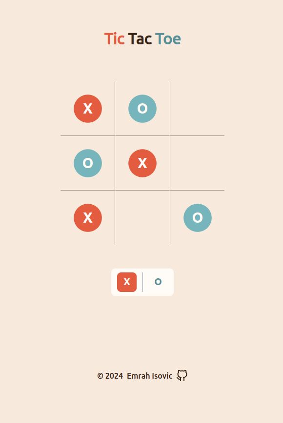

# Tic-Tac-Toe
Welcome to my Tic Tac Toe game. It's a straightforward, no-fuss way to pass the time and have a little fun. Whether you're up for a quick match with a friend or want to test your wits against the AI, this game's got you covered.

## Table of concepts
- [Overview](#overview)
  - [Screenshot](#screenshot)
  - [Links](#links)
- [Built with](#built-with)
- [Author](#author)

## Overview

### Screenshot

### Links
  - Live preview - [Tic-Tac-Toe](https://emrahiso.github.io/Tic-Tac-Toe/)
  - GitHub repo - [Tic-Tac-Toe Repo](https://github.com/EmrahIso/Tic-Tac-Toe)

## Built with 
  - HTML
  - CSS
  - JavaScript
  - DOM
  
## Author

- GitHub - [@EmrahIso](https://github.com/EmrahIso)